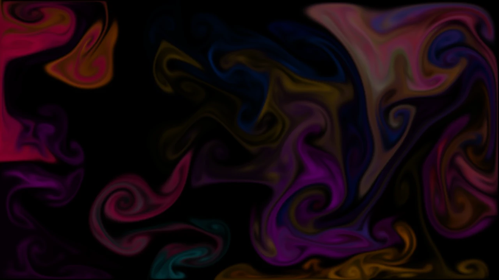
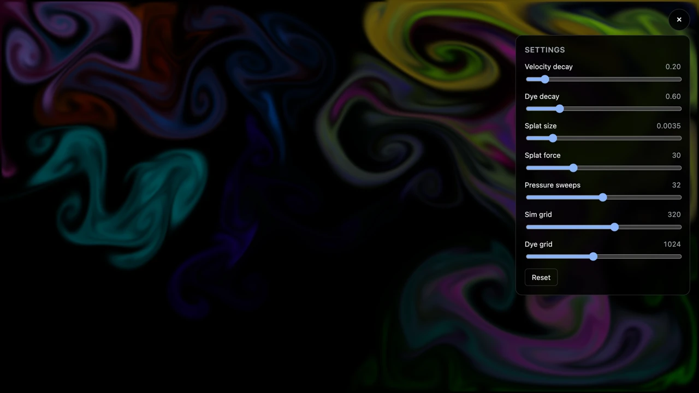

# DreamVision

Real-time fluid simulation filling the browser viewport, solved entirely on the
GPU with [WebGPU](https://www.w3.org/TR/webgpu/) compute shaders. It opens
mid-motion and settles as the dye dissipates; drag anywhere to stir it. Under
`prefers-reduced-motion` it opens still instead, and waits for a drag or a
keypress before it animates. A panel behind the gear in the corner tunes the
solver live — decay rates, splat size and force, pressure sweeps, and the grid
resolutions — and remembers what you set.

**[Open the live demo →](https://dreamvision.nemolize.workers.dev/)**
(needs a [WebGPU-capable browser](#requirements))



Built with React + Vite and deployed to
[Cloudflare Workers](https://workers.cloudflare.com/) as static assets.

## Requirements

**WebGPU is required** — there is no WebGL or CPU fallback. On a browser
without it the page shows a short notice instead of the canvas. This is a
deliberate choice for an experimental demo: a single code path is worth more
here than broad reach.

## Getting Started

- [mise](https://mise.jdx.dev/) provisions Node.js and pnpm at the versions
  pinned in `mise.toml`.

```bash
mise install
pnpm install
pnpm dev
```

`mise install` has to come first: everything after it runs on the Node.js and
pnpm it puts on your `PATH`. Git hooks install themselves as part of
`pnpm install`.

## How it works

A [stable-fluids](https://www.dgp.toronto.edu/people/stam/reality/Research/pdf/ns.pdf)
solver (Stam 1999) runs as five compute passes per frame over storage textures:

1. **advect** — carry velocity along itself
2. **splat** — inject a blob of force and colour, once per splat the frame has
   to place
3. **divergence** — measure how much the velocity field compresses
4. **pressure** — Jacobi sweeps solving for the pressure that cancels it
5. **gradient subtract** — remove that pressure gradient, leaving a
   divergence-free field

The dye field then advects along the projected velocity and a fullscreen
triangle draws it.

Splats come from two places: a drag, and a burst thrown in at startup so the
first frame is already in motion — the burst is skipped entirely under
`prefers-reduced-motion`. A seeded splat lands once rather than
accumulating over a drag's frames, so it is injected brighter to compensate
(`SEED_DYE_GAIN`).

The solver advances by a fixed timestep while the frame loop accumulates real
elapsed time, so the fluid behaves the same on a 60Hz and a 120Hz display. A
gap longer than one frame's budget — a hidden tab, a slept machine — is capped
at that budget rather than banked, so returning to the tab resumes from the
present instead of fast-forwarding through the gap. If the GPU device is lost, the
canvas is replaced by a notice instead of freezing in place.

Two grids are in play: velocity and pressure run on a coarse grid, dye on a
finer one, because colour detail is what the eye actually resolves. Both are
fitted to the viewport's aspect so cells stay square. Tunables live in
`src/fluid/config.ts`.

Textures are 32-bit float: WebGPU guarantees write-only storage access for
those formats, while the 16-bit forms need an optional feature. They are not
filterable in exchange, so the shaders interpolate by hand.

The conversion between stored velocity and grid cells is derived in
`src/fluid/projection.ts` rather than written into the shader, so
`projection.test.ts` can check the operators on the CPU — the shaders need a
GPU adapter, which makes those numbers the one part of the solver a unit test
can reach.

One deviation from a textbook solver remains: `divergence` and
`gradientSubtract` use central differences while the Jacobi sweep solves a
1-cell Laplacian, so the sweep does not invert the operator whose divergence it
is given. From a cold start, enough sweeps would make that cost real accuracy —
but this solver never solves cold: the pressure field carries over between
frames, so each solve resumes the last one, and what survives is dominated by
the low frequencies the sweep is slow on rather than by the stencil. Measured
that way the two schemes converge on each other as the loop runs, to within a
tenth of a point. Doing it properly also means moving the velocity components
onto cell faces, which advection and the splat would have to follow. Numbers and
the options are in
[#681](https://github.com/nemolize/dreamvision/issues/681).

### The settings panel

The gear opens seven sliders over the running canvas. The five solver settings
reach the running frame as the slider moves; the two grid resolutions wait for
the drag to end, for the reason the next section gives. All seven are stored, so
the next load opens where you left it.



### What the resolution sliders cost

The grids are the one setting that cannot take effect on the next frame:
changing either rebuilds every texture. The rebuild builds the new set, carries
the live velocity and dye onto it with a resample pass, and only then releases
the old one — so the fields survive, at the cost of both sets being alive across
one submit. Pressure is not carried; the Jacobi sweeps rebuild it within the
frame.

At the panel's maxima (sim 512, dye 2048) the textures come to ~83 MB on a 16:9
viewport, transiently ~166 MB during a rebuild, against ~22 MB at the defaults.
On an M-series Mac every step from the defaults to the maxima holds the display's
120 Hz cap with no device loss, so nothing the panel offers saturates that
machine; under the software renderer the Playwright suite uses — which does not
hit a vsync cap, and so is the reading that separates the steps — the maxima cost
about 2.2x the defaults per frame.

Both readings are one machine each. A memory-tight GPU may still lose the device
at a raised setting, so the notice that reports a lost device offers to reset the
resolution and reload — the stored value is what the next load rebuilds at, and
without that the notice would be a dead end.

## Project layout

- `src/fluid/` — the simulation: WGSL shaders, the WebGPU pipeline setup
  (`pipelines.ts`), the per-resolution resources (`resources.ts`), the frame
  encoder (`frame.ts`), device acquisition (`gpu.ts`), and pointer tracking
- `src/FluidCanvas.tsx` — the canvas host; owns the animation loop, and holds
  the settings the panel edits alongside any failure to report
- `src/SettingsPanel.tsx` — the collapsible panel of solver controls
- `src/GpuNotice.tsx` — what replaces the canvas when the GPU fails, including
  the offer to reset the resolution
- `e2e-tests/` — Playwright specs, including one that drags across the canvas
  and asserts pixels actually light up

## Scripts

| Script                   | What it does                                       |
| ------------------------ | -------------------------------------------------- |
| `pnpm dev`               | Start the development server                       |
| `pnpm build`             | Production build                                   |
| `pnpm preview`           | Serve the production build on the Workers runtime  |
| `pnpm lint`              | ESLint + type-check + Prettier check (in parallel) |
| `pnpm fix`               | Auto-fix ESLint and Prettier issues                |
| `pnpm test`              | Unit tests (Vitest)                                |
| `pnpm run test:coverage` | Unit tests with coverage                           |
| `pnpm run test:e2e`      | End-to-end tests (Playwright)                      |

### Testing notes

The shaders cannot be unit-tested: they need a real GPU adapter, which Node has
no implementation of. Their coverage comes from the Playwright suite, which
drives a real drag and then asserts the picture keeps changing after the
pointer is released. That second assertion is the load-bearing one: lit pixels
alone prove nothing, since the splat pass writes colour straight under the
drag path — only advection over a projected velocity field keeps the field
moving with no further input. Verified by disabling advection and confirming
the suite fails.

The drag case runs with the startup burst switched off via `?seed=off`. Without
that the assertions cannot attribute what they see — on a pre-seeded canvas the
drag case passed with the drag deleted, which is how the switch came to exist.
The burst has its own case on the default page, resting on the drag case to
establish that the canvas is otherwise black. Verified by mutation: disabling
either source fails its own case and only its own.

What that suite cannot see is whether the projection is _right_: a wrong sign,
a swapped axis, or a missing per-axis weight still leaves something that looks
like a fluid. `projection.test.ts` covers that gap by rebuilding the discrete
operators from the factors in `projection.ts` and checking the identities they
have to satisfy. It is a check on the derivation, not on the shader — the
operators are transcribed by hand, so editing a projection pass means editing
its twin in the test. Verified by mutation: reverting each factor to a wrong
value fails at least one assertion.

E2E runs against the Vite dev server by default; in CI (and with `E2E_PREVIEW=1`
locally) it runs against the production build served by the Workers runtime.
Both servers bind to port `5173`; `PLAYWRIGHT_PORT` moves the dev server, the
preview server, and the Playwright target together:

```bash
PLAYWRIGHT_PORT=5187 pnpm run test:e2e
```

Reading a WebGPU canvas back in a test needs a screenshot — the drawing buffer
is not preserved, so `drawImage` onto a 2D canvas yields transparent black
regardless of what was presented.

## Deployment

- Push to `main` deploys to production (`wrangler deploy`).
- Pull requests upload a preview version; the URL is posted as a sticky PR
  comment. Fork PRs are skipped, since GitHub withholds the secret from them.

Worker configuration lives in `wrangler.json`; the deployable config is
generated under `dist/` by `@cloudflare/vite-plugin` during `pnpm build`.
